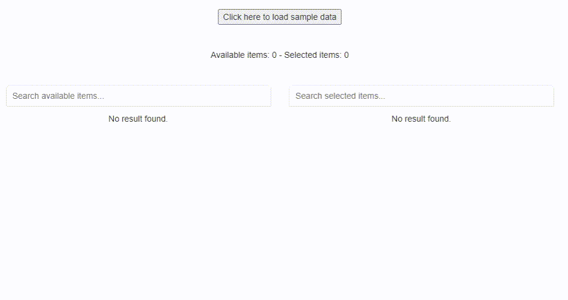

# Dual Listbox (Vue 2) 

<a target="_blank" href="LICENSE" title="License: MIT"></a>

## Features
This dual list box allows to manage lists of objects (available/selected) grouping data by a field.



The lists of objects have the following structure:
```
[
    ...
{ "category": "Category 1", "name": "Item 1.5" },
{ "category": "Category 1", "name": "Item 1.6" },
{ "category": "Category 2", "name": "Item 2.1" },
    ...
]
```

You can select/remove a single item or select the whole group.

## Minimal usage

```
<dual-listbox 
    v-model="dualListBoxData"
    category-field="category"
    display-field="name"
    key-field="name"
```

## Complete usage

```
<dual-listbox 
    v-model="dualListBoxData"
    category-field="category"
    display-field="name"
    key-field="name"
    label-search-available="Search available items..."
    label-search-selected="Search selected items..."
    label-add="Add ›"
    label-remove="‹ Remove"
    label-no-result="No result found"
    icons-theme="chevron"
    @@add="onItemsAdded"
    @@remove="onItemsRemoved" />
```

## EXAMPLE 1: Usage in vue file

### 1. Prepare data in a script
```
<script>
import DualListBox from './components/DualListBox.vue'

export default {
  name: 'App',
  components: {
    DualListBox
  },
  data() {
    return {
      dualListBoxData: {
        availableItems: [],
        selectedItems: [],
      }
    }
  },
  methods: {
    loadData() {
      // simulate ajax call
      setTimeout(() => {
      
        this.dualListBoxData = {
          availableItems: [
            { "category": "Category 1", "name": "Item 1.1" },
            { "category": "Category 1", "name": "Item 1.2" },
            { "category": "Category 1", "name": "Item 1.3" },
            { "category": "Category 1", "name": "Item 1.4" },
            { "category": "Category 1", "name": "Item 1.5" },
            { "category": "Category 1", "name": "Item 1.6" },
            { "category": "Category 2", "name": "Item 2.1" },
            { "category": "Category 2", "name": "Item 2.2" },
            { "category": "Category 2", "name": "Item 2.3" },
            { "category": "Category 2", "name": "Item 2.4" },
            { "category": "Category 2", "name": "Item 2.5" },
            { "category": "Category 2", "name": "Item 2.6" },
            { "category": "Category 3", "name": "Item 3.1" },
            { "category": "Category 3", "name": "Item 3.2" },
            { "category": "Category 3", "name": "Item 3.3" },
            { "category": "Category 3", "name": "Item 3.4" },
            { "category": "Category 3", "name": "Item 3.5" },
            { "category": "Category 3", "name": "Item 3.6" },        
          ],
          selectedItems: [],
        };

      }, 1000);    
    },
    onItemsAdded(selectedItems) {
      console.info("Adding:");
      for (let item of selectedItems) {            
        console.info(JSON.stringify(item));
      }
    },
    onItemsRemoved(selectedItems) {
      console.info("Removing:");
      for (let item of selectedItems) {            
        console.info(JSON.stringify(item));
      }
    }
  }
}
</script>
```

### 2. Call component in a template
```
<template>
<div id="app">

<DualListBox 
    v-model="dualListBoxData"
    :removeItemsOnSelect="true"
    categoryField="category" 
    displayField="name" 
    keyField="name" 
    labelSearchAvailable="Search available items..."
    labelSearchSelected="Search selected items..."
    labelAdd="Add ›"
    labelRemove="‹ Remove"
    labelNoResult="No result found."
    iconsTheme="chevron"
    @add="onItemsAdded"
    @remove="onItemsRemoved"
    />
    
</div>
</template>    
```


## EXAMPLE 2: Usage as js library

### 1. Import library
```
 <script type="text/javascript" src="dual-listbox.umd.min.js"></script>
```

### 2. Use component in HTML file - script
```
<script>
Vue.component("dual-listbox", window["dual-listbox"]);

var app = new Vue({
    el: '#app',
    data: {
        dualListBoxData: {
            availableItems: [
                { "category": "Category 1", "name": "Item 1.1" },
                { "category": "Category 1", "name": "Item 1.2" },
                { "category": "Category 1", "name": "Item 1.3" },
                { "category": "Category 1", "name": "Item 1.4" },
                { "category": "Category 1", "name": "Item 1.5" },
                { "category": "Category 1", "name": "Item 1.6" },
                { "category": "Category 2", "name": "Item 2.1" },
                { "category": "Category 2", "name": "Item 2.2" },
                { "category": "Category 2", "name": "Item 2.3" },
                { "category": "Category 2", "name": "Item 2.4" },
                { "category": "Category 2", "name": "Item 2.5" },
                { "category": "Category 2", "name": "Item 2.6" },
                { "category": "Category 3", "name": "Item 3.1" },
                { "category": "Category 3", "name": "Item 3.2" },
                { "category": "Category 3", "name": "Item 3.3" },
                { "category": "Category 3", "name": "Item 3.4" },
                { "category": "Category 3", "name": "Item 3.5" },
                { "category": "Category 3", "name": "Item 3.6" },
            ],
            selectedItems: [],
        }
    },
    methods: {
        onItemsAdded: function(selectedItems) {
            console.info("Adding:");
            for (var i = 0; i < selectedItems.length; i++) {
                console.info(JSON.stringify(selectedItems[i]));
            }
        },
        onItemsRemoved: function(selectedItems) {
            console.info("Removing:");
            for (var i = 0; i < selectedItems.length; i++) {
                console.info(JSON.stringify(selectedItems[i]));
            }
        }
    }
});
</script>
```


### 3. Use component in HTML file - HTML
```
<div id="app">

    <dual-listbox 
        v-model="dualListBoxData"
        category-field="category"
        display-field="name"
        key-field="name"
        label-search-available="Search available items..."
        label-search-selected="Search selected items..."
        label-add="Add ›"
        label-remove="‹ Remove"
        label-no-result="No result found"
        icons-theme="chevron"
        @@add="onItemsAdded"
        @@remove="onItemsRemoved" />

</div>
```

# Available themes

Chevron:
```
...
iconsTheme="chevron"
...
```

Plus:
```
...
iconsTheme="plus"
...
```

## Project setup
```
npm install
```

### Compiles and hot-reloads for development
```
npm run serve
```

### Publish DualList component as external library
```
npm run publish
```

### Lints and fixes files
```
npm run lint
```